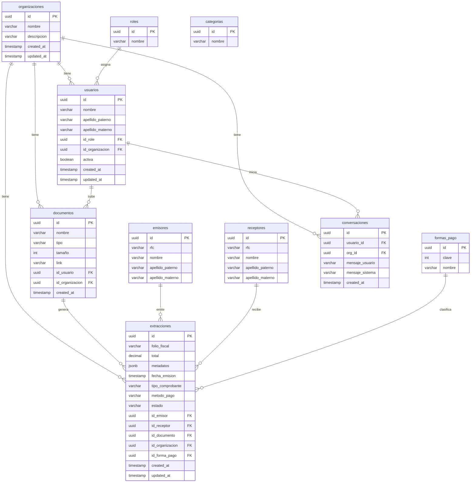

# Base de datos

Visir usa **Supabase** (PostgreSQL) como base de datos. El aislamiento multi-tenant se implementa con **Row Level Security (RLS)** — cada fila solo es visible para el usuario o la organización que le corresponde.

Las migraciones viven en `migrations/` y se aplican en orden desde el SQL Editor de Supabase.

---

## Tablas

| # | Archivo | Tabla |
|---|---|---|
| 00 | `20260519140000_create_organizaciones.sql` | `organizaciones` |
| 01 | `20260519140001_create_roles.sql` | `roles` |
| 02 | `20260519140002_create_categorias.sql` | `categorias` |
| 03 | `20260519140003_create_usuarios.sql` | `usuarios` |
| 04 | `20260519140004_create_emisores.sql` | `emisores` |
| 05 | `20260519140005_create_formas_pago.sql` | `formas_pago` |
| 06 | `20260519140006_create_documentos.sql` | `documentos` |
| 07 | `20260519140007_create_extracciones.sql` | `extracciones` |
| 08 | `20260519140008_create_conversaciones.sql` | `conversaciones` |
| 09 | `20260519140009_rls_policies.sql` | Políticas RLS |
| 10 | `20260519140010_create_receptores.sql` | `receptores` |
| 11 | `20260519140011_seed_data.sql` | Datos de prueba |

---

## Diagrama entidad-relación



---

## Autenticación y usuarios

La tabla `usuarios` no almacena email ni contraseña. Esos datos los maneja **Supabase Auth** en `auth.users`. La columna `id` de `usuarios` es una FK a `auth.users(id)`, lo que vincula el perfil de la app con la cuenta de autenticación.

---

## Row Level Security

Todas las tablas tienen RLS habilitado. Las políticas se basan en dos funciones helper que leen el JWT del usuario:

```sql
get_my_org_id()  -- devuelve el org_id del token
get_my_role()    -- devuelve el rol del token ('owner', 'admin', 'usuario')
```

### Matriz de permisos

| Tabla | owner | admin | usuario |
|---|---|---|---|
| `organizaciones` | CRUD total | CRUD su org | Solo lectura su org |
| `roles` | CRUD total | Solo lectura | Solo lectura |
| `categorias` | CRUD total | Solo lectura | Solo lectura |
| `usuarios` | CRUD total | CRUD su org | Ver y editar su propio perfil |
| `emisores` | CRUD total | Ver e insertar | Solo lectura |
| `receptores` | CRUD total | Ver e insertar | Solo lectura |
| `formas_pago` | CRUD total | Solo lectura | Solo lectura |
| `documentos` | CRUD total | CRUD su org | CRUD sus documentos en su org |
| `extracciones` | CRUD total | CRUD su org | Solo lectura su org |
| `conversaciones` | CRUD total | CRUD su org | CRUD sus conversaciones en su org |

---

## Valores válidos en extracciones

**`tipo_comprobante`**
- `'Ingreso'`
- `'Egreso'`
- `'Traslado'`
- `'Nómina'`
- `'Pago'`
- `'Retención e información de pagos'`

**`metodo_pago`**
- `'PUE'` — Pago en una sola exhibición
- `'PPD'` — Pago en parcialidades o diferido

**`estado`**
- `'pendiente'` (default)
- `'procesado'`
- `'error'`
