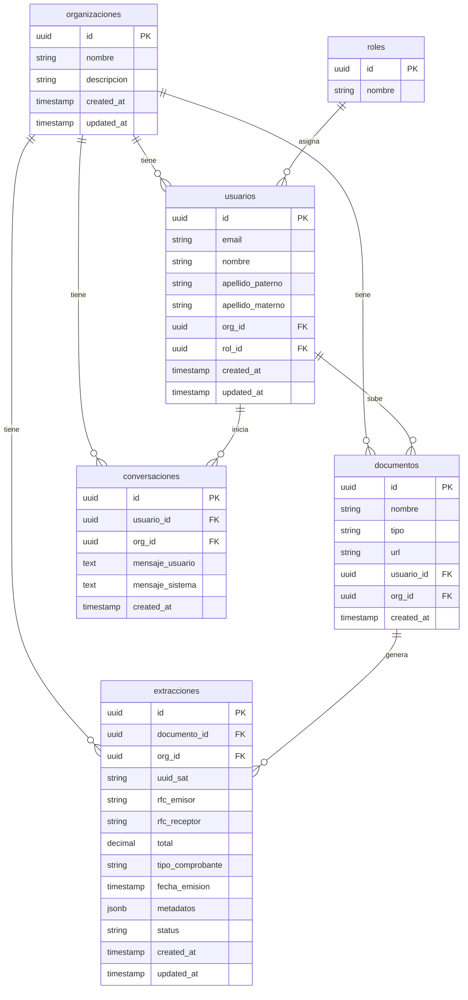

## Esquema de base de datos

El sistema maneja 6 tablas por el momento,cuentan con aislamiento multi-tenant mediante Row Level Security.

### Diagrama entidad-relación

### Roles y permisos

| Rol | Acceso |
|---|---|
| `owner` | Todo el sistema sin restricción de organización |
| `admin` | Todo dentro de su organización |
| `usuario` | Solo sus propios datos dentro de su organización |

