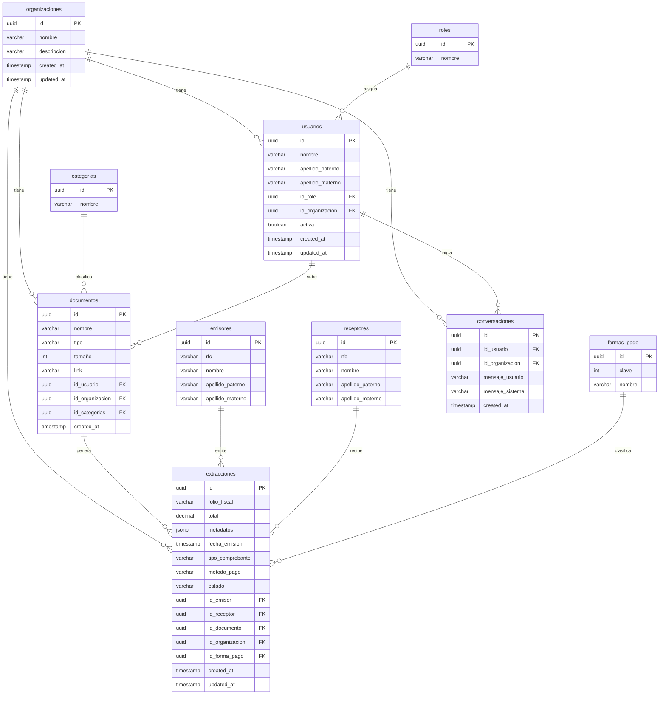

# Base de datos

Visir usa Supabase (PostgreSQL). El aislamiento multi-tenant se implementa con Row Level Security — cada fila solo es visible para el usuario o la organización que le corresponde.

Las migraciones viven en `migrations/` y se aplican en orden desde el SQL Editor de Supabase.

---

## Orden de migraciones

| Archivo | Tabla |
|---|---|
| `20260519140000_create_organizaciones.sql` | `organizaciones` |
| `20260519140001_create_roles.sql` | `roles` |
| `20260519140002_create_categorias.sql` | `categorias` |
| `20260519140003_create_usuarios.sql` | `usuarios` |
| `20260519140004_create_emisores.sql` | `emisores` |
| `20260519140006_create_receptores.sql` | `receptores` |
| `20260519140007_create_formas_pago.sql` | `formas_pago` |
| `20260519140008_create_documentos.sql` | `documentos` |
| `20260519140009_create_conversaciones.sql` | `conversaciones` |
| `20260519140010_create_extracciones.sql` | `extracciones` |
| `20260519140011_rls_policies.sql` | RLS, trigger, grants |
| `20260519140012_seed_data.sql` | Datos de prueba |

---

## Diagrama entidad-relación

---

### Permisos por tabla

| Tabla | owner | admin | usuario |
|---|---|---|---|
| `organizaciones` | CRUD total | CRUD su org | Solo lectura su org |
| `roles` | CRUD total | Solo lectura | Solo lectura |
| `categorias` | CRUD total | Solo lectura | Solo lectura |
| `usuarios` | CRUD total | CRUD su org | Ver y editar su propio perfil |
| `emisores` | CRUD total | Ver e insertar | Solo lectura |
| `receptores` | CRUD total | Ver e insertar | Solo lectura |
| `formas_pago` | CRUD total | Solo lectura | Solo lectura |
| `documentos` | CRUD total | CRUD su org | CRUD sus docs en su org |
| `extracciones` | CRUD total | CRUD su org | Solo lectura su org |
| `conversaciones` | CRUD total | CRUD su org | CRUD sus conversaciones en su org |

---

## Valores válidos en extracciones

**`tipo_comprobante`**:
`'Ingreso'`, `'Egreso'`, `'Traslado'`, `'Nómina'`, `'Pago'`, `'Retención e información de pagos'`

**`metodo_pago`**: `'PUE'` (pago en una sola exhibición), `'PPD'` (pago en parcialidades o diferido)

**`estado`**: `'pendiente'` (default), `'procesado'`, `'error'`
